# 👋 Hi, I'm Clarisse Memba

This portfolio showcases projects completed during my Data Analysis Bootcamp. Below you’ll find examples of my work across multiple tools and technologies.Im passionate about building impactful solutions with software, automation, cloud technologies, and AI. Always learning, solving problems, and creating value through technology.
 
##  Skills & Knowledge acquired
### Excel & Data Basics
- Data types, data management and entry  
- Analysis and visualization
- Pivot tables, conditional formatting, grouping, sorting & filtering
- Creating formulas and charts (line, histograms, bar, pie)
- Data security best practices
### Python & Google Colab
- Python syntax, calculations, and analysis
- Libraries: Pandas, NumPy, Matplotlib, Seaborn
- Data indexing, slicing, manipulation, aggregation, and grouping
- Data visualization and export
### SQL & MySQL Workbench
- Database structuring and relational database design (Snowflake schema)
- Entity Relationship Diagrams (ERDs)
- Creating and manipulating database records
- Building business databases from scratch
### Tableau & Power BI
- Data import, analysis, and trend identification
- Designing and publishing interactive dashboards
- Report creation with visual insights
### Microsoft Azure
- Cloud-based data analysis tools and integration

##  Projects by Tool

### Excel Projects
#### Project 1: Retail Sales Dataset Analysis and Excel Automation
Organise raw sales using retail sales dataset: converting this data into a sturctured table, apply sorting and filtering techniques, and perform basic business calculations for business reporting.
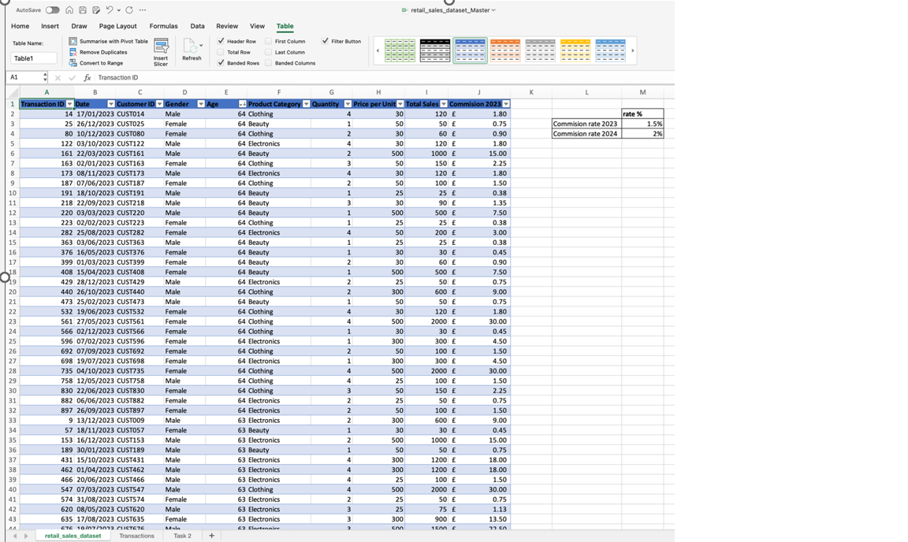

#### Project 2: Student Performance Analysis in Excel
The objective was to identify top-performing students, calculate averages, determine the highest scores, and apply conditional formatting to highlight key performance indicators.
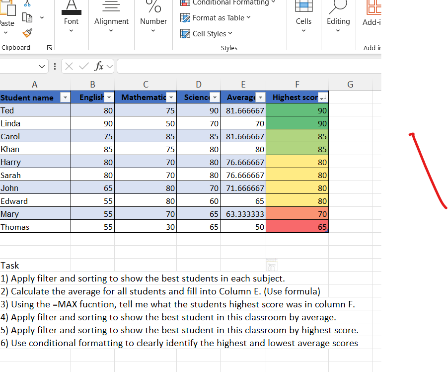
#### Project 3:Bike Sales Pivot Table Analysis
The aim was to transform raw sales data into meaningful insights by summarizing and analyzing customer purchasing patterns.The goal was to summarize order quantities and identify trends within customer demographics.
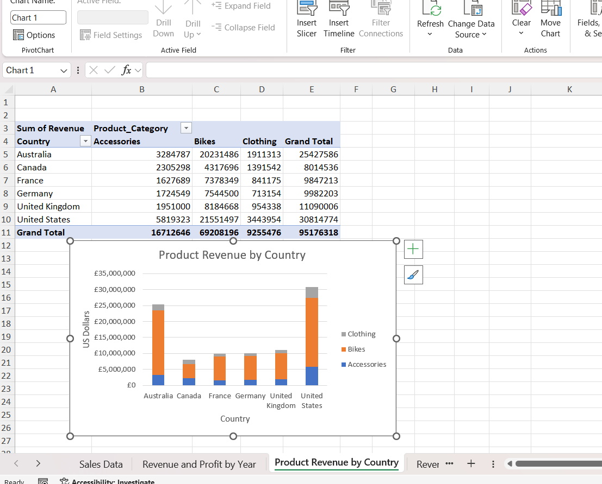

### Python & Google colab
Hands-on data analysis using Python libraries.
[Python coding notebook 2](Python_coding2.ipynb)

### Tableau Projects
#### Project 1:Health Gapminder Dataset Analysis – Identifying Trends and Support Opportunities
This project analyzes the Health Gapminder dataset to identify health and development trends across countries and regions. The aim was to provide evidence-based insights that organizations, NGOs, governments, and healthcare providers can use to prioritize future support, interventions, and resource allocation.

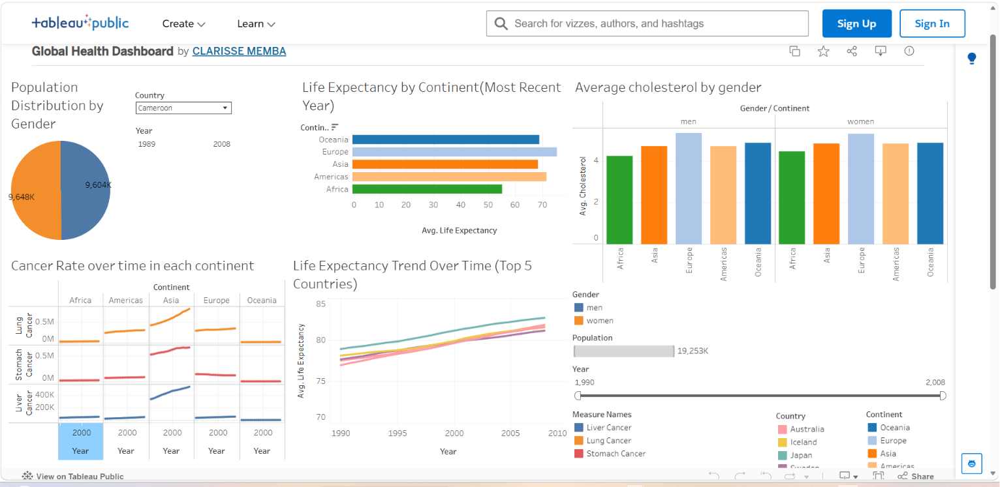
[link](https://public.tableau.com/app/profile/clarisse.memba/viz/GlobalHealthDashboard_17803513394810/GlobalHealthInsights?publish=yes)
### Power BI
#### Project 1:Sales Analysis and Data Transformation with Power BI
This project demonstrates how to use Microsoft Power BI and Power Query Editor to extract, transform, clean, and analyze sales data from the AdventureWorks database. The project focuses on preparing raw sales data for business intelligence reporting and generating actionable insights through data modeling and visualization.
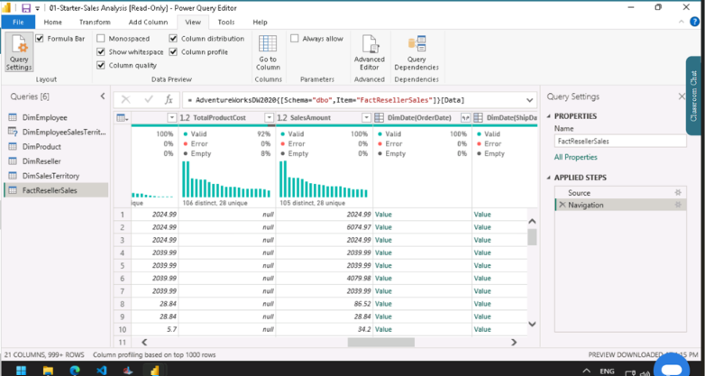
#### Project 2: Design Power BI Reports for Sales Analysis
Using the Adventure Works sales dataset, the project focuses on transforming business data into meaningful visualizations and dashboards that help stakeholders monitor sales performance, profitability, product demand, and regional trends. The report combines multiple visualizations, filters, and analytical features to provide a comprehensive view of organizational sales performance.
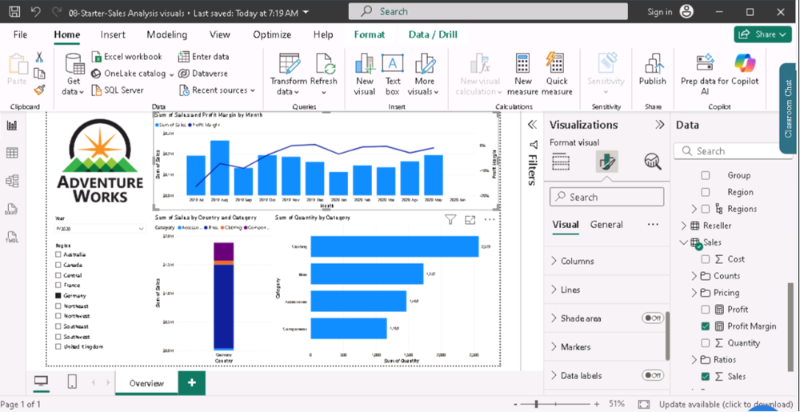 

### SQL Projects
#### Project 1: Spotify Data Analysis Database Design (ERD)
This ERD models geographical and demographic data using three tables. A one-to-many relationship exists between Country and City because one country can contain many cities. Another one-to-many relationship exists between Country and CountryLanguage because a country can have multiple spoken languages. Foreign keys in the City and CountryLanguage tables link back to the Country table, ensuring data integrity and allowing analysis of countries, their cities, populations, and languages through SQL queries and joins.
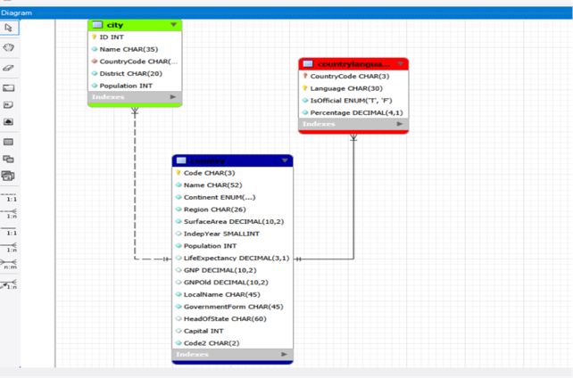
#### Project 2: World Database SQL Analysis Project
This project demonstrated the use of SQL queries in MySQL Workbench to analyze the World Database (world_db). The objective was to retrieve, filter, sort, and analyze global data relating to countries, cities, populations, languages, and regions.
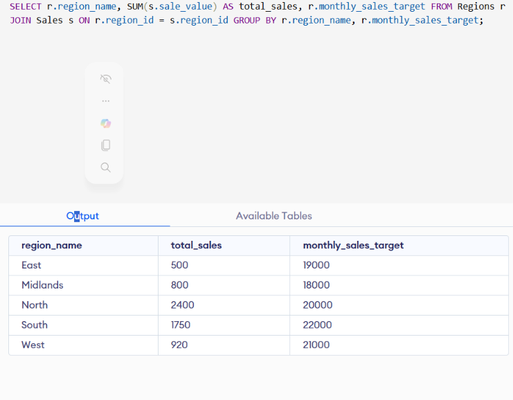 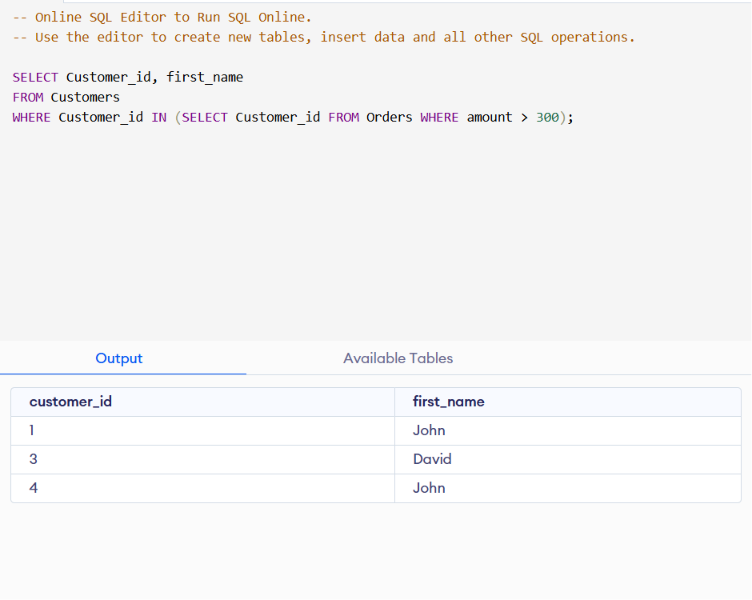 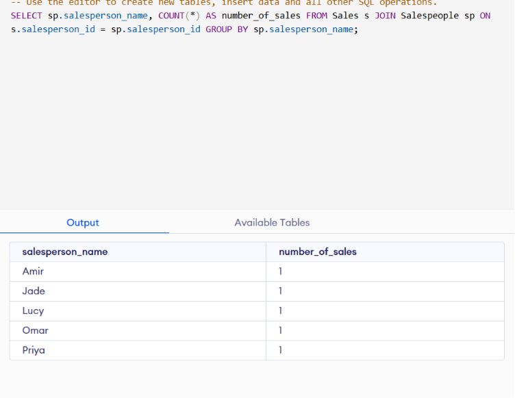 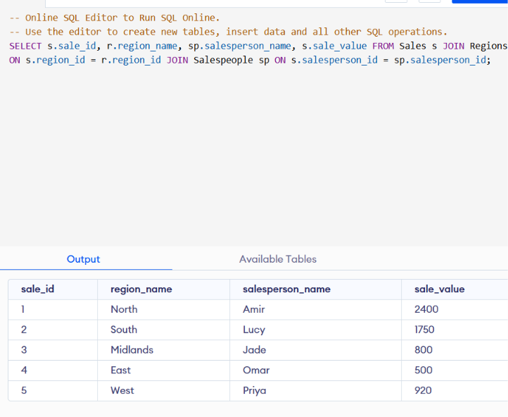

#### Project 3: Retail Shop Database Design and Development
This project outlines the design and implementation of a database system for a small corner shop that sells groceries and household products. The shop currently manages information manually and requires a database to streamline inventory management, sales tracking, customer information, and its loyalty rewards program.
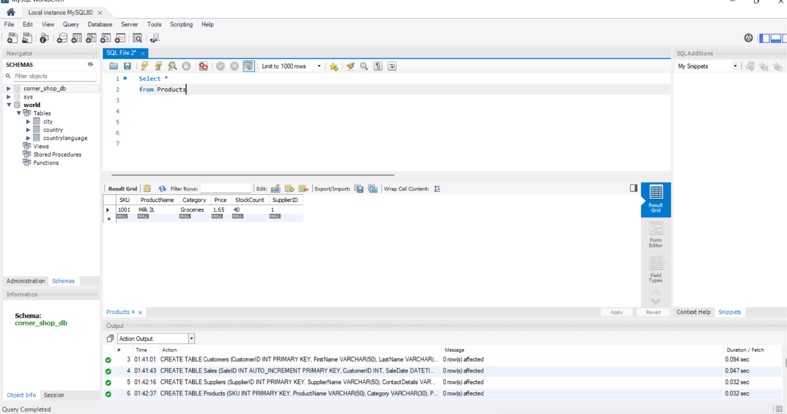

### Microsoft Azure
#### Project: Exploring relational and non relational databases in Microsoft azure
This project explores the implementation, management, and comparison of relational and non-relational (NoSQL) database solutions available in Microsoft Azure. The goal is to understand their architecture, capabilities, performance characteristics, scalability, and appropriate use cases in modern cloud applications. This project demonstrates how Azure database services can be leveraged to build secure, scalable, and efficient data-driven applications.
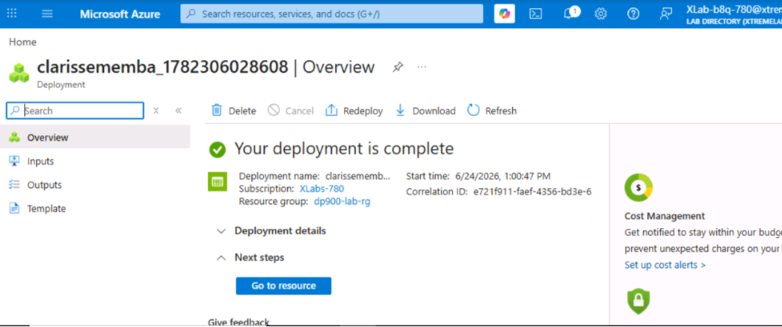
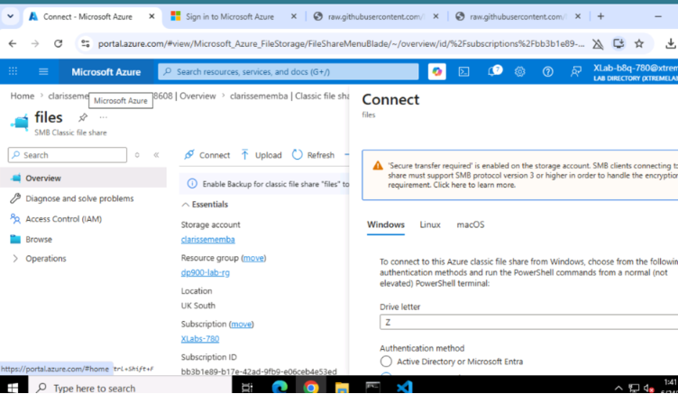

## 🔗 Let's Connect

**📧 Email:** [clarissebaari@gmail.com](mailto:clarissebaari@gmail.com)
**💼 LinkedIn:** [linkedin.com/in/yourusername](https://www.linkedin.com/in/clarisse-baari-memba-794b3b253/?lipi=urn%3Ali%3Apage%3Ad_flagship3_profile_view_base_contact_details%3Bx7A%2F9fqPTL%2BF%2F9KL8%2Fe4Ow%3D%3D)
**🐙 GitHub:** [github.com/DAclarissememba-png](https://github.com/DAclarissememba-png)

Have questions or feedback? Feel free to reach out!
